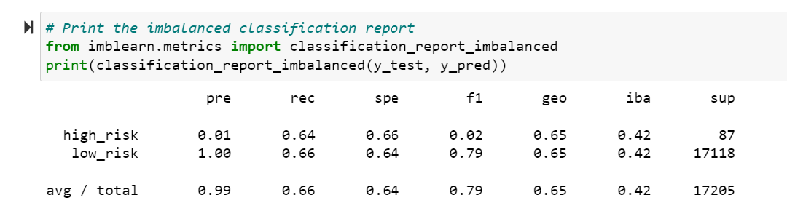
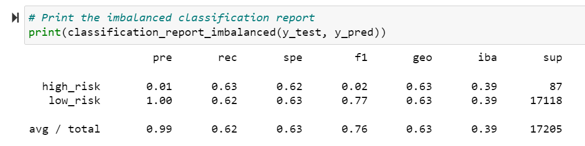
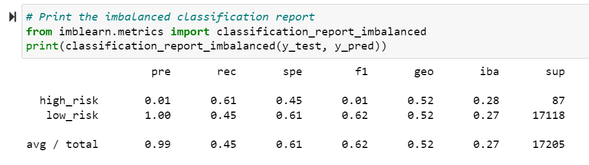
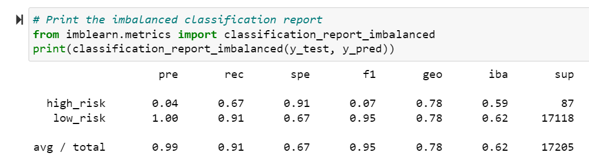
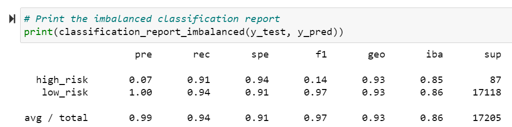

# Credit Risk Analysis

## Overview of the analysis

Credit risk is very tough to predict. In this project we want to take a look at how all the factors in our loan_stats csv help predict whether someone is low or high risk status. One method that data scientists use for this type of issue is creating a model and then evaluate and train the models that they create. In this specific project we are using imbalanced-learn and scikit-learn libraries to build models and evalute them using a resampling method. In the first couple of models I oversampled the data using randomoversampler and smote algorithms and undersample the data with the clustercentroid algorithm. In the remaining models I used a combination approach to over and undersample the data using smoteenn. Finally, I compared two machine learning models that minimize bias, balancedrandomforestclassifier and easyensembleclassifier.

## Purpose

1. Explain how a machine learning algorithm is used in data analytics.
2. Create training and test groups from a given data set.
3. Implement the logistic regression, decision tree, random forest, and support vector machine algorithms.
4. Interpret the results of the logistic regression, decision tree, random forest, and support vector machine algorithms.
5 Compare the advantages and disadvantages of each supervised learning algorithm.
6. Determine which supervised learning algorithm is best used for a given data set or scenario.
7 Use ensemble and resampling techniques to improve model performance.

## Results

### Naive Random Oversampling

1. Balanced Accuracy: 0.6494474459230252
2. Precision: The precision is low for High-risk loans and is high for Low-risk loans.
3. Recall: High/Low risk = 0.64/0.66

### SMOTE Oversampling

1. Balanced Accuracy: 0.6278982398040377
2. Precision: The precision is low for High-risk loans and is high for Low-risk loans.
3. Recall: High/Low risk = 0.63/0.62

### Undersampling

1. Balanced Accuracy: 0.6278982398040377
2. Precision: The precision is low for High-risk loans and is high for Low-risk loans.
3. Recall: High/Low risk = 0.61/0.45

### Combination (Over and Under) Sampling

_Sampling.png)

1. Balanced Accuracy: 0.5291858539710166
2. Precision: The precision is low for High-risk loans and is high for Low-risk loans.
3. Recall: High/Low risk = 0.70/0.57

### Balanced Random Forest Classifier

1. Balanced Accuracy: 0.7877672625306695
2. Precision: The precision is low for High-risk loans and is high for Low-risk loans.
3. Recall: High/Low risk = 0.67/0.91 

### Easy Ensemble AdaBoost Classifier

1. Balanced Accuracy: 0.925427358175101
2. Precision: The precision is low for High-risk loans and is high for Low-risk loans.
3. Recall: High/Low risk = 0.91/0.94

## Summary

When working with balanced accuracy, the highest compared accuracy between 0 and 1 and is closest to 1 is the best machine learning model. For the credit card data set, the Easy Ensemble AdaBoost Classifier is the best model to choose with its 0.93 balanced accuracy. The other models were below 0.80 balanced accuracy. The precision for all models were similar and within an appropriate range. The recall score also needs to fall within 0 and 1, with numbers closer to 1 being the better model. The Easy Ensemble AdaBoost Classifier had the highest recall score, making it the final best machine learning model to choose for further credit card analysis.
